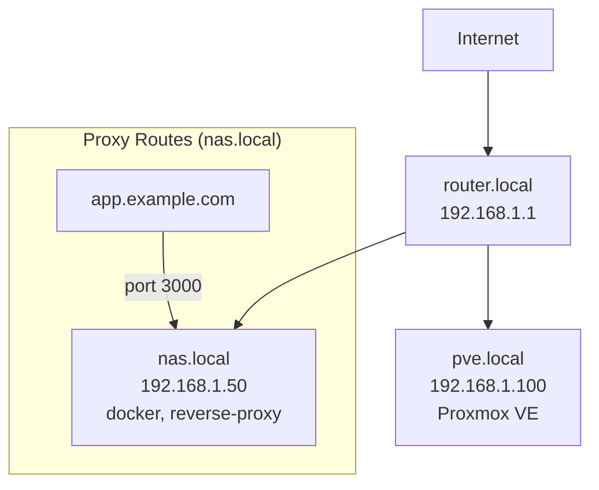

# Homenet Discovery

Automatically discover and document home network infrastructure, creating both human-readable documentation and machine-queryable inventory data.

## Workflow

Copy and track progress:
```
Discovery Progress:
- [ ] Step 0: Validate environment
- [ ] Step 1: Check for existing config
- [ ] Step 2-5: First-run setup (if needed)
- [ ] Step 6: Run discovery methods
- [ ] Step 7: Consolidate results
- [ ] Step 8: Generate outputs
- [ ] Step 9: Cache results
- [ ] Step 10: Report summary
```

**First run** (no config) → Steps 0-10
**Subsequent run** (config exists) → Steps 0, 1, then skip to Step 6

## Discovery Methods

- **nmap** - Network-wide host discovery
- **SSH** - Deep inspection of accessible hosts
- **DNS** - Enumeration and zone transfers
- **Manual drops** - User-provided command outputs from `/tmp/homenet/`

## Data Locations

- Config: `~/.config/homenet/config.toml`
- Inventory: `~/.local/share/homenet/` (inventory.md, report.md, topology.mermaid)
- Manual drops: `/tmp/homenet/` (user places outputs here)

## Execute ALL steps in sequence

### Step 0: Validate Environment

Run setup script to create directories and check prerequisites:

```bash
bash scripts/setup.sh
```

Parse output:
- `PREREQUISITES: ALL_INSTALLED` → Proceed to Step 1
- `PREREQUISITES: MISSING` → Check which tools missing
  - `MISSING_TOOL: python3` → STOP. Report: "python3 required. Install hints provided."
  - `MISSING_TOOL: nmap` → CONTINUE but disable nmap discovery
  - `MISSING_TOOL: dig` → CONTINUE but disable DNS discovery
  - `MISSING_TOOL: ssh` → CONTINUE but disable SSH probing

Display any `INSTALL_HINT:` lines to user for missing tools.

### Step 1: Check for Existing Configuration

Read `~/.config/homenet/config.toml`

**If exists:** Skip to Step 6
**If missing:** Proceed to Step 2 (first run)

### Step 2: Show Prerequisites Guide

Display to user:

```
# homenet - First-Time Setup

Prerequisites are optional. Basic discovery works without any setup.

## SSH Key Access (Recommended)
Deploy SSH keys for passwordless deep inspection:
```bash
ssh-copy-id user@host1.lab
ssh-copy-id user@host2.lab
```

Without this: SSH discovery skipped (nmap still works)

## DNS Zone Transfer (Optional)
Enable AXFR on DNS server.

**OPNsense/pfSense:** Services → Unbound DNS → Access Lists → Add your IP
**Pi-hole:** Already allows local transfers

Without this: DNS uses basic queries only

## Network Scanning
nmap required for host discovery.
- Basic scanning works without sudo
- OS detection requires sudo (will prompt if needed)

## Manual Command Outputs (Optional)
Drop command outputs in `/tmp/homenet/` for enhanced discovery.

Create directory:
```bash
mkdir -p /tmp/homenet
```

**Proxmox:**
```bash
pvesh get /nodes --output-format json > /tmp/homenet/proxmox-nodes.json
pvesh get /cluster/resources --output-format json > /tmp/homenet/proxmox-resources.json
```

**OPNsense:**
Export config via WebUI: System → Configuration → Backups → Download
Save as: `/tmp/homenet/opnsense-config.xml`

**UniFi:**
Login to controller, navigate to: `https://YOUR-CONTROLLER/api/s/default/stat/device`
Save JSON as: `/tmp/homenet/unifi-devices.json`

---

Ready to configure discovery methods?
```

### Step 3: Interactive Configuration

Use AskUserQuestion tool:

**Q1 - DNS Server:**
"What's your local DNS server IP?"
- Auto-detect (use /etc/resolv.conf)
- 192.168.1.1
- 10.0.0.1
- 172.16.0.1

**Q2 - Primary Network:**
"What is your primary home network range?"
- 192.168.1.0/24
- 192.168.0.0/24
- 10.0.0.0/24
- 172.16.0.0/16

**Q3 - Discovery Methods (multiSelect):**
"Which discovery methods should be enabled?"
- Nmap scanning (recommended)
- SSH probing (requires keys)
- DNS enumeration
- Manual file parsing

**Q4 - SSH Username (if SSH selected):**
"What username for SSH connections?"
- Current user ($USER)
- root
- admin
- ubuntu

**Q5 - DNS Domain (if DNS enum selected):**
"What is your local DNS domain?"
- Auto-detect (from hostname)
- home.lab
- local
- lan

### Step 4: Create Directory Structure

```bash
mkdir -p ~/.config/homenet/templates ~/.local/share/homenet/cache /tmp/homenet
```

### Step 5: Save Configuration

Write `~/.config/homenet/config.toml` with user's answers:

```toml
[general]
first_run_complete = true
last_scan = "{YYYY-MM-DD}"

[dns]
servers = ["{from-Q1}"]
domains = ["{from-Q5-or-empty}"]

[network]
subnets = ["{from-Q2}"]

[methods]
nmap = {true/false from Q3}
ssh = {true/false from Q3}
dns_enum = {true/false from Q3}
manual_drops = {true/false from Q3}

[ssh]
default_user = "{from-Q4-or-$USER}"
known_hosts = []

[output]
formats = ["json", "markdown", "mermaid"]
path = "~/.local/share/homenet"
```

Confirm: "Configuration saved to ~/.config/homenet/config.toml"

### Step 6: Run Discovery

Load config from `~/.config/homenet/config.toml` and parse TOML.

#### 6a. Parse Manual Drops (if enabled)

If `methods.manual_drops = true`:

```bash
ls -1 /tmp/homenet/ 2>/dev/null
```

For each file found, run parser:

```bash
cat /tmp/homenet/proxmox-nodes.json | python3 parsers/proxmox.py nodes
cat /tmp/homenet/proxmox-resources.json | python3 parsers/proxmox.py resources
cat /tmp/homenet/opnsense-config.xml | python3 parsers/opnsense.py
cat /tmp/homenet/unifi-devices.json | python3 parsers/unifi.py
```

Extract IPs from parser outputs. Store for enumeration.

#### 6b. Nmap Discovery (if enabled)

If `methods.nmap = true`:

**Phase 1 - Find hosts:**
```bash
./scripts/nmap-scan.sh discover {subnet}
```

Run for each subnet in `network.subnets` and any VLAN subnets from OPNsense.
Outputs: Live host IPs, MACs, vendors.

**Phase 2 - Enumerate services:**
```bash
./scripts/nmap-scan.sh enumerate {comma-separated-ip-list}
```

Run on all discovered IPs.
Outputs: Services per host (ports, banners).

#### 6c. SSH Discovery (if enabled)

If `methods.ssh = true`:

For each discovered host:
```bash
./scripts/ssh-probe.sh {ssh.default_user}@{host}
```

Silently skip connection failures.

Outputs structured sections:
- SYSTEM → OS info
- HOSTNAME → Hostname
- INTERFACES → Network interfaces
- DOCKER → Container names/images
- SERVICES → systemd services
- PROXY_CONFIGS → Reverse proxy configs (Caddy, nginx, Traefik, HAProxy)

Extract proxy routing from PROXY_CONFIGS:
- Caddy: `reverse_proxy` + `host` matchers
- nginx: `server_name` + `proxy_pass`
- Traefik: routers → services
- HAProxy: `acl` + `use_backend`

Store domain → backend mappings.

#### 6d. DNS Discovery (if enabled)

If `methods.dns_enum = true`:

Check if `dns.domains` is empty:
- If empty: Skip, inform user to edit config or reconfigure
- If not empty: Proceed

For each DNS server and domain:
```bash
./scripts/dns-enum.sh {dns-server} {domain}
```

Attempts AXFR zone transfer. Falls back to queries if refused.
Outputs: DNS A records (hostname, IP).

### Step 7: Consolidate Results

Merge all discovery results into unified inventory.

Deduplicate by MAC (preferred) or IP (fallback).
Trust hierarchy: SSH > nmap > DNS > manual.

Store consolidated data with:
- ip, mac, hostname, os, services, discovered_by, proxy_routes

### Step 8: Generate Outputs

#### 8a. AI Inventory

Generate structured markdown for AI consumption.
Format: See `templates/inventory-format.md`
Write to: `~/.local/share/homenet/inventory.md`

#### 8b. Human Report

Generate human-readable summary with tables.
Format: See `templates/report-format.md`
Write to: `~/.local/share/homenet/report.md`

#### 8c. Mermaid Topology

Generate network diagram including:
- Hosts with IPs and services
- VLAN subnets (if detected)
- Reverse proxy routes (if found)

Example:


Write to: `~/.local/share/homenet/topology.mermaid`

### Step 9: Cache Results

```bash
cp ~/.local/share/homenet/inventory.json \
   ~/.local/share/homenet/cache/last-scan-$(date +%Y-%m-%d).json
```

### Step 10: Report Summary

Display to user:
```
Network discovery complete!

Discovered: N hosts across M subnets
Methods used: {enabled methods}

Outputs saved:
- ~/.local/share/homenet/inventory.md
- ~/.local/share/homenet/report.md
- ~/.local/share/homenet/topology.mermaid

Other skills can now query your network inventory.
```

**Context-aware guidance:**

If Proxmox detected:
- Read `templates/proxmox-commands.txt`
- Show relevant commands from file

If OPNsense/pfSense detected:
- Read `templates/opnsense-commands.txt`
- Show instructions from file

If UniFi detected:
- Read `templates/unifi-commands.txt`
- Show relevant commands from file

Finally:
```
To reconfigure: delete ~/.config/homenet/config.toml and re-run
To refresh inventory: re-run this skill anytime
```

## Error Handling

**nmap not found:**
- Inform user: "nmap not installed. Install with: brew install nmap (Mac) or apt install nmap (Linux)"
- Skip nmap discovery, continue with other methods

**SSH connection failures:**
- Skip unreachable hosts silently
- Don't fail entire discovery

**DNS zone transfer refused:**
- Fall back to individual record queries
- Note in output that zone transfer unavailable

**Empty /tmp/homenet/:**
- Skip manual parsing
- Not an error

## Notes

- Discovery is non-destructive and read-only
- Scanning uses standard nmap timing (not aggressive)
- SSH uses BatchMode (no interactive prompts)
- Config and data persist across sessions
- Other skills can query inventory via file reads
